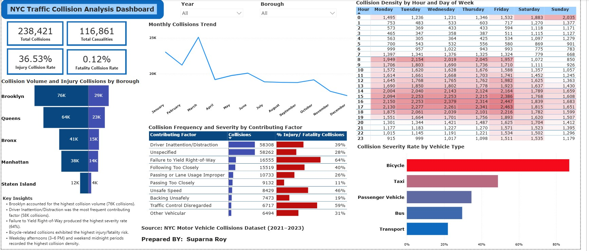

## Dashboard Preview


# NYC Traffic Collision Analysis Dashboard (Power BI)

## Project Overview

This project presents an interactive Power BI dashboard analysing **NYC Motor Vehicle Collision** data from **2021 to 2023**. The objective was to explore collision patterns, identify high-risk contributing factors, evaluate injury severity, and uncover temporal and geographic trends to support data-driven traffic safety decisions.

The project was inspired by the **Maven Analytics** guided project *Traffic Safety Analysis*, originally developed in **Microsoft Excel** and instructed by **Enrique Ruiz**. Rather than reproducing the Excel solution, I rebuilt the analysis entirely in **Power BI** and extended it with additional interactive features, DAX measures, and enhanced visualisations.

---

##  Project Objectives

* Analyse traffic collision patterns across New York City.
* Identify the leading contributing factors behind collisions.
* Compare collision severity across different vehicle types.
* Explore collision distribution across NYC boroughs.
* Investigate temporal trends by month, hour, and day of the week.
* Build an interactive dashboard to support exploratory analysis.

---

## Dashboard Features

### Executive KPIs

* Total Collisions
* Total Casualties
* Injury Collision Rate
* Fatality Collision Rate

### Geographic Analysis

* Collision Volume and Injury Collisions by Borough

### Contributing Factor Analysis

* Top contributing factors ranked by collision frequency
* Injury/Fatality severity rate for each contributing factor

### Vehicle Risk Analysis

* Collision Severity Rate by Vehicle Type

### Time-Based Analysis

* Monthly Collision Trend
* Collision Density Heatmap (Hour × Day of Week)

### Interactive Features

* Year slicer (2021–2023)
* Borough slicer
* Dynamic filtering across all visuals

---

## Key Insights

* Brooklyn recorded the highest collision volume, accounting for approximately **76,000 collisions**.
* Driver Inattention/Distraction was the most common contributing factor with over **58,000 collisions**.
* Failure to Yield Right-of-Way exhibited the highest injury/fatality severity rate (**64%**) among the major contributing factors.
* Bicycle-related collisions demonstrated the highest injury/fatality risk compared with other vehicle types.
* Friday afternoons (3 PM–6 PM) and weekend midnight periods showed the highest collision density.

---

## Enhancements Beyond the Original Excel Project

Compared with the original guided Excel project, this Power BI implementation includes several additional features:

* Interactive dashboard with cross-filtering
* Year and Borough slicers
* DAX measures for KPI calculations
* Injury and Fatality Rate metrics
* Collision Severity analysis
* Vehicle Type risk comparison
* Hour-by-Day collision density heatmap
* Executive dashboard layout and data storytelling

---

## Tools & Technologies

* Microsoft Power BI
* Power Query
* DAX (Data Analysis Expressions)
* Microsoft Excel

---

## 📂 Repository Contents

```text
📁 NYC-Traffic-Collision-Analysis-PowerBI
│
├── NYC_Collision_Analysis.pbix
├── NYC Accidents 2020.csv
├── NYC Collision Power BI Project.jpg
├── Recording 2026-06-23 202250.mp4
└── README.md
```

---

## Acknowledgements

This project was inspired by the **Traffic Safety Analysis** guided project created by **Maven Analytics** and instructed by **Enrique Ruiz**.

---

## 👤 Author

**Suparna Roy**

Master of Business Analytics
Adelaide University

LinkedIn: *www.linkedin.com/in/supornaroy*


